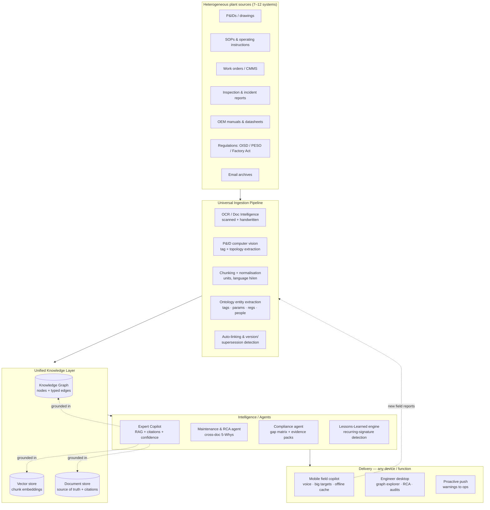

# Sutradhar — Architecture

Sutradhar is the "Unified Asset & Operations Brain": one queryable, cited,
continuously-updated knowledge layer over the 7–12 disconnected document systems
a large plant runs on.

## 1. System diagram

## 2. Prototype ↔ production mapping

| Concern | This prototype | Production |
|---|---|---|
| Document store | `src/lib/store.ts` in-memory, `globalThis`-persisted | Postgres / S3 (immutable source of truth) |
| Vector search | Deterministic BM25 + entity-tag boosting (`rag/retrieve.ts`) | pgvector / Upstash + BM25 hybrid re-rank |
| Knowledge graph | Typed nodes/edges in memory (`data/seed.ts`, `ingest.ts`) | Neo4j / Neptune with the same ontology |
| Entity extraction | Ontology regex extractors (`ontology.ts`) + optional LLM | Same ontology + fine-tuned NER + P&ID CV |
| Answer synthesis | Vercel AI Gateway (`ai/client.ts`) with offline extractive fallback | Same gateway, streaming, per-tenant model routing |
| Ingestion input | Text paste / `.txt` upload / URL / P&ID image | OCR (scanned/handwritten), CV for P&IDs, spreadsheet & email parsers |
| Auth & roles | Signed-cookie sessions, `proxy.ts` gate, demo users (admin / user) | SSO/OIDC per plant, same role interface |

The interfaces are identical — only the backing implementations swap. Every
answer already carries `docId` + `locator` citations, so provenance survives the
migration.

## 3. Design principles (why it scores)

1. **Trust by construction.** Answers are cited or refused. A safety-critical
   intent (bypass/override a protection) is *always* declined and redirected to
   Management-of-Change — because this is a safety system, not a chatbot.
   (`rag/copilot.ts`, `ontology.ts` `SAFETY_INTENT`)
2. **The graph is the moat.** Value is in *linkage*, not retrieval. Three work
   orders, an inspection, an incident and an email all converge on one root
   cause no single engineer had assembled. (`rag/rca.ts`, `lessons.ts`)
3. **Offline-first reliability.** Zero-dependency retrieval + rule engines mean
   the demo never hard-fails; the LLM is an enhancement, not a crutch.
4. **Field reality.** Mobile bottom-nav, voice input, big touch targets,
   version-conflict flagging, messy-scan/handwriting/Hindi awareness.
5. **Continuously updated.** New documents extract + auto-link into the existing
   graph live (`/ingest`), so the brain compounds instead of going stale.

## 4. Data model (ontology)

- **Entities:** `Equipment`, `Parameter`, `Regulation`, `Person`, `FailureMode`,
  `Document`, `Unit`.
- **Edges:** `MENTIONS`, `CONNECTED_TO`, `GOVERNS`, `PERFORMED_ON`, `INVOLVES`,
  `EXHIBITS`, `APPLIES_TO`, `AUTHORED`, `SUPERSEDES`, `PART_OF`.

See `src/lib/types.ts` for the full schema.
